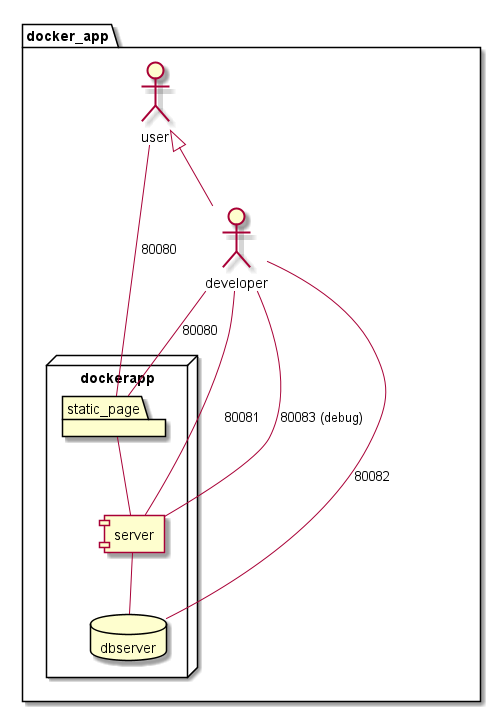

# Docker Apps architecture

## Main picture

## Ports

| Use | Inside container | Outside Container | Visibility |
| --- |:----------------:|:-----------------:|:----------:|
| Front-end | `80` | `80000` | User, Developer |
| Back-End | `9090` | `80081` | User, Developer |
| Back-End Debug | `9091` | `80083` | Developer |
| Database | `????` | `80082` | Developer |

## Pieces

### Front-end

Accessible from outside, shows the application. Should be visible to User and Developer.

### Back-End

It can be accessible from outside. Used on development type.

### Back-End Debug

Can be accessible from outside for developers only.

### Database

Depending on the database, developer should access.